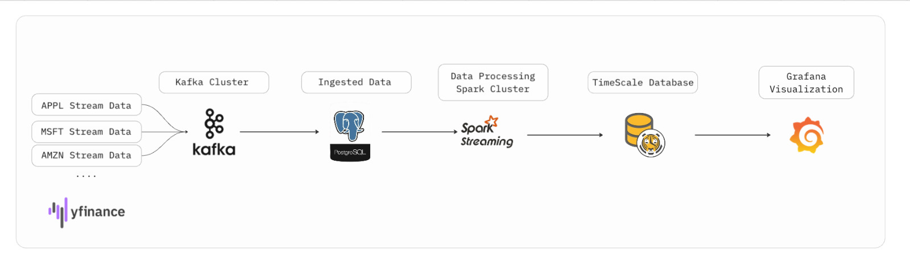
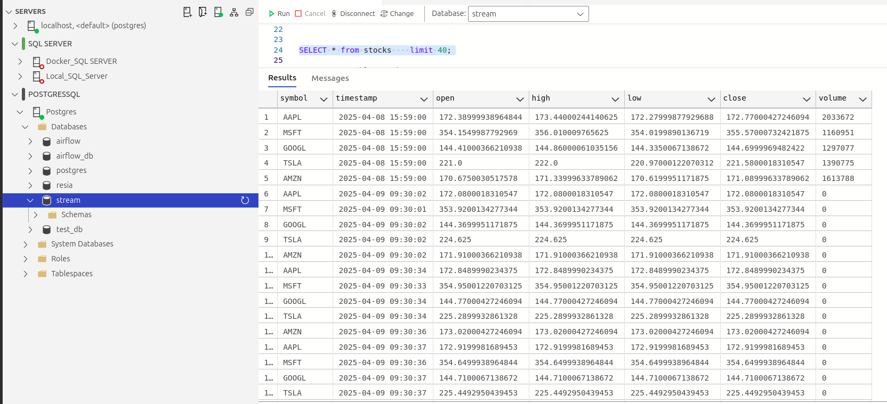
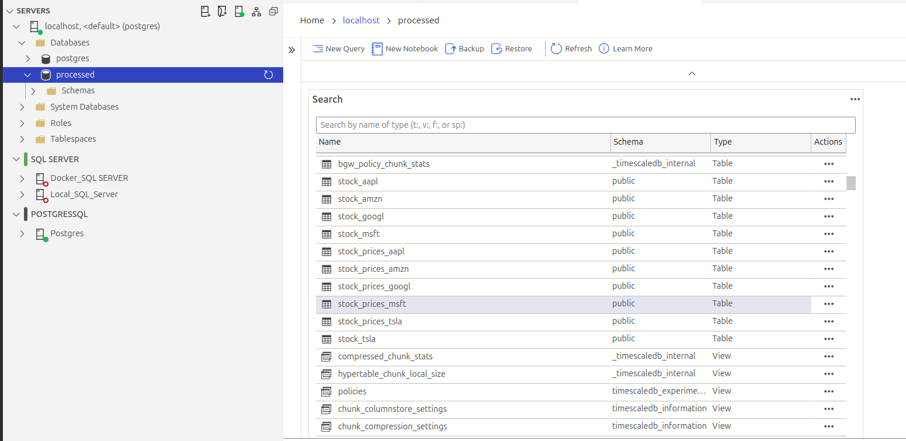

# Real-Time Stock Price Streaming and Visualization Pipeline



## 📌 Overview

This project demonstrates a full end-to-end real-time data engineering pipeline for stock price data, using:

- **Yahoo Finance API** (via `yfinance`) to fetch live stock data
- **Apache Kafka** for real-time streaming
- **PostgreSQL** for raw data persistence
- **Apache Spark Structured Streaming** for real-time transformation
- **TimescaleDB** for time-series optimized storage database
- **Grafana** for live visualization

The pipeline is designed to be modular, fault-tolerant, and scalable, capable of ingesting and processing high-frequency stock data in near real-time.

---

## 📦 Project Structure

```bash
project/
│
├── producer.py            # Fetches stock data from Yahoo Finance and sends to Kafka
├── consumer.py            # Consumes Kafka data and inserts into PostgreSQL
├── spark_processor.py     # Processes PostgreSQL data and writes to TimescaleDB
├── Screenshot.png         # Architecture image for README
└── README.md              # Project documentation (you are here)
```

---

## 🔄 Data Flow

1. **Producer (Kafka)**
   - Retrieves real-time stock prices for predefined symbols (`AAPL`, `MSFT`, `GOOGL`, `TSLA`, `AMZN`).
   - Sends JSON messages every 5 seconds to a Kafka topic (`stock_prices`).

2. **Consumer (PostgreSQL)**
   - Listens to Kafka topic and inserts new data into a `stocks` table.
   - Ensures idempotency using `ON CONFLICT DO NOTHING`.

3. **Spark Structured Streaming**
   - Reads new data from PostgreSQL in a straming mode and implement CDC consept.
   - Dynamically separates the data by stock symbol.
   - Writes the results into dedicated tables in **TimescaleDB** using `stock_<symbol>` naming.

4. **Grafana**
   - Connects to TimescaleDB.
   - Visualizes time-series metrics like `close` price over time, per symbol.

---
## 🔄 Data in Postgres 



## 🔄 Data in TimeScaleDB 


## 📊 Grafana Integration

**To create Grafana dashboards:**

1. Go to `http://localhost:3000/` (Grafana UI).
2. Add a new PostgreSQL data source with:
   - Host: `localhost:5434`
   - Database: `processed`
   - User: `postgres`
   - Password: `2590`
3. Save & Test.

**Example Query for `AAPL`:**

```sql
SELECT
  time_bucket('1m', timestamp) AS time,
  AVG(close) AS close_price
FROM stock_prices_aapl
WHERE $__timeFilter(timestamp)
GROUP BY time
ORDER BY time
```

---

## 🧠 Technologies Used

| Component     | Tool             |
|---------------|------------------|
| API Source    | Yahoo Finance API |
| Messaging     | Apache Kafka      |
| Database 1    | PostgreSQL        |
| Processing    | Apache Spark      |
| Time Series DB| TimescaleDB       |
| Dashboard     | Grafana           |

---

## 🛠️ How to Run

1. **Start Kafka and Zookeeper**

```bash
docker-compose up -d
```

2. **Run Producer**

```bash
python producer.py
```

3. **Run Consumer**

```bash
python consumer.py
```

4. **Run Spark Job**

```bash
spark-submit spark_processor.py
```

5. **Open Grafana**

Go to `http://localhost:3000`, configure data source, and start creating dashboards.

---

## 📈 Screenshot


---

## 🧪 Sample Output

**Kafka Message:**

```json
{
  "symbol": "AAPL",
  "timestamp": "2025-04-10T16:59:00Z",
  "open": 177.12,
  "high": 178.03,
  "low": 176.97,
  "close": 177.98,
  "volume": 1432100
}
```

---

## 🧹 Maintenance & Monitoring

- **Kafka Lag** can be monitored via `kafka-consumer-groups.sh`.
- **Spark Structured Streaming UI** at `http://localhost:4040` helps trace performance.
- **Grafana Alerts** can notify anomalies (e.g., large price jumps).

---

## 🧩 Extensibility

This project can be extended with:

- Real-time ML anomaly detection
- Integration with Redis or ElasticSearch
- Real-time trade volume analysis
- CI/CD automation with Airflow or Dagster

---

## 👨‍💻 Author

**Mohamed Ghareb Mohamed Elamin**  
Bachelor of Science in Computer and Systems Engineering  
[GitHub](https://github.com/M0hmdghareb) | [LinkedIn](https://www.linkedin.com/in/mahamed-gharib)

---

